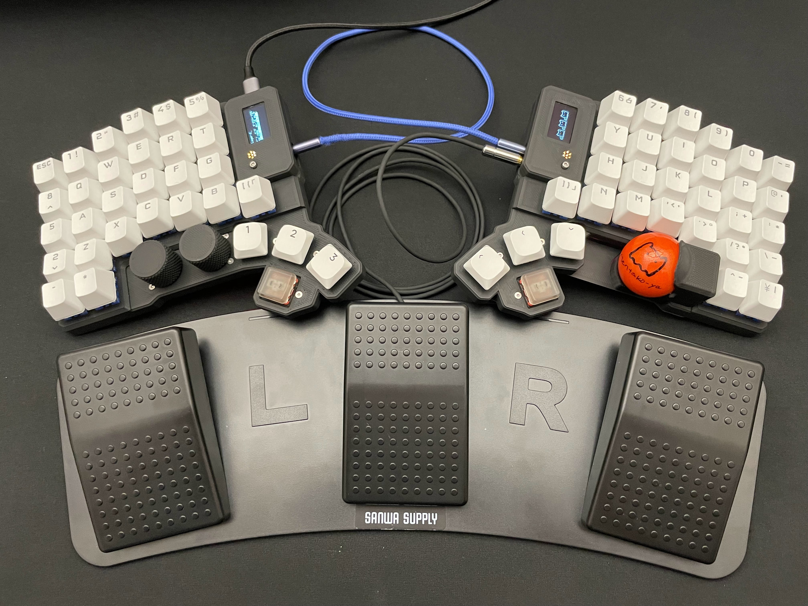
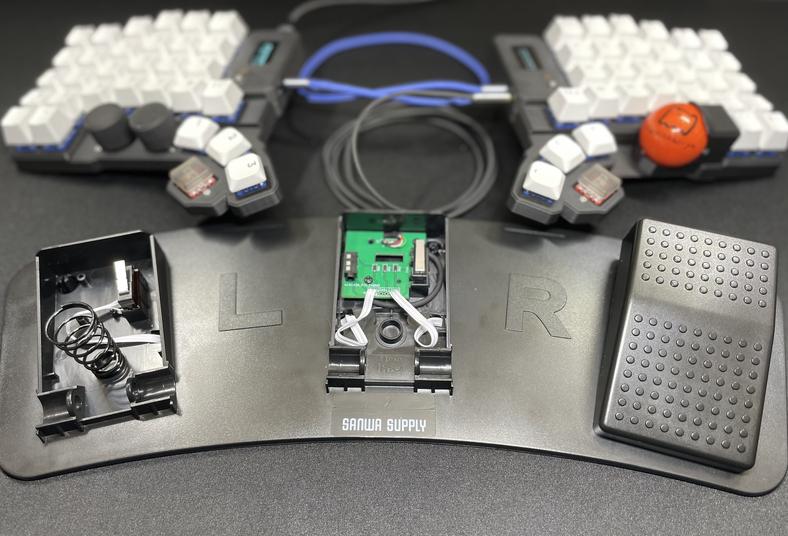
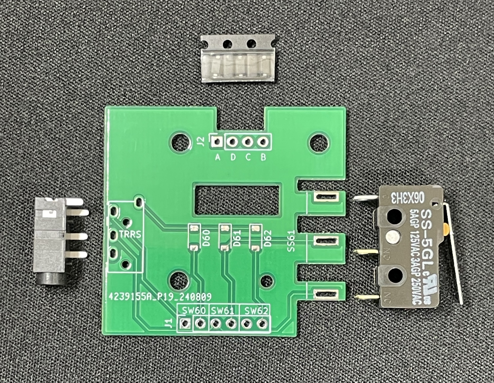
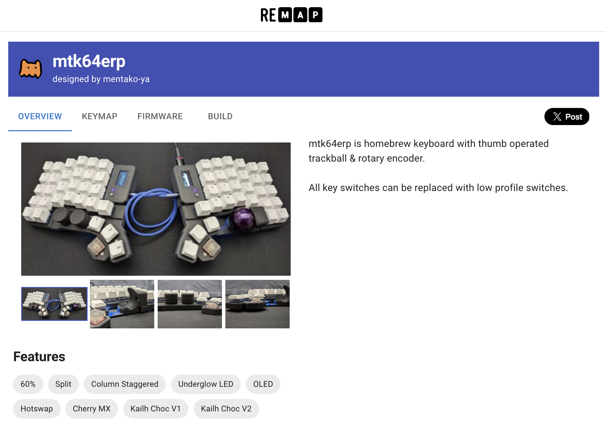

[English](README.en.md)

# mtk64erp

親指操作トラックボールとロータリーエンコーダー付き自作キーボード

## オンラインストア
https://mentako-ya.myshopify.com

## News
[しんぴのモノローグ](https://shinpi-gadget.com/)様にて[mtk64erpのレビュー](https://shinpi-gadget.com/mtk64erp-review/)をご掲載いただきました

キーキャップMX互換:[CORSAIR PBT DOUBLE-SHOT 交換用カラーキーキャップセット - 日本語108キー, Arctic White - CH-9911040-JP](https://amzn.asia/d/1FShFiO)

キーキャップChocV2:[XVX ロープロファイル PBT キーキャップ](https://amzn.asia/d/7V1A6T4)

キーキャップChocV1:[Chocfox CFX keycap](https://chosfox.com/products/chocfox-cfx-choc-keycaps?bg_ref=3KtshOemT6)

トラックボール：[ぺリックス PERIPRO-303WH 34mm](https://amzn.asia/d/1paUF5C)

TRRSケーブル：https://shop.dailycraft.jp/products/trrs_cable_50_gloss

USB Type-cケーブル：https://amzn.asia/d/h8pfZIJ

 
アンダーグローLED

 
追加の親指キースイッチは低くオフセットされている

 
OLED 128X64, レイヤー表示LED、リセットボタン

 
Alps alpine 低背エンコーダー、30クリック、プッシュスイッチ付き

 
PMW3389 トラックボールセンサーはキー押下時の干渉を避けるために低くオフセット

 

 
Chock V1/ [V2 (with out fixed pin model)](https://ja.aliexpress.com/item/1005007361067887.html) / MX互換キースイッチを全キーに取り付け可能

   

 
フットスイッチ拡張キット 
[市販のUSBフットスイッチ](https://amzn.asia/d/h7wMR24)の基板と差し替えてmtk64erpに接続

 
新しい qmk_firmware と RP2040 MCU によるポーリング レートの向上

 
[remap-keys.app](https://remap-keys.app/catalog/heEVSWdH2LCyxbQcQWwg) に登録 キーマップの変更、設定したキーマップの保存、共有、復元が可能

* サポートされているハードウェア: 

    MCU     : RP2040

    OLED    : SSD1306 128X64 

    Trackball sensor : PixArt PMW3389

    Encoder : Alps alpine EC12D

## ビルドムービー
https://www.youtube.com/playlist?list=PL_GJMtxZ-TgrWXYJNq9W5JQL1H6cIPeTs

## ファームウェア
[mtk_mtk64erp_via.uf2](firmware/mtk_mtk64erp_via.uf2)

### via.json
[mtk64erp_via.json](firmware/mtk64erp_via.json)

### ソースコード
https://github.com/mentako-ya/qmk_firmware/tree/master/keyboards/mtk/mtk64erp

Make example for this keyboard (after setting up your build environment):

    qmk compile -kb mtk/mtk64erp -km via

Flashing example for this keyboard:

    qmk flash -kb mtk/mtk64erp -km via

See the [build environment setup](https://docs.qmk.fm/#/getting_started_build_tools) and the [make instructions](https://docs.qmk.fm/#/getting_started_make_guide) for more information. 
Brand new to QMK? Start with our [Complete Newbs Guide](https://docs.qmk.fm/#/newbs).

### ブートローダー

2 つの方法でブートローダーに入る:

* **物理リセットボタン**: リセットボタンを短く2回押す
* **レイアウト内のキーコード**: `QK_BOOT` にマッピングされたキーを押す

## キーマッピング
https://remap-keys.app/configure を使用してキー マッピングを変更可能

 1. キーボードを接続する

    

    
 
 1. 任意のキーをレイヤー0~7にマッピング
* Layer 0       通常のキー

    

* Layer 1       Shiftキーによる入力に相当

    

* Layer 2       マウスボタン、カーソルキー

    

* Layer 3       トラックボール設定 (カスタム キーコードを参照)、LED 設定、トラックボールをスクロール モードに切り替え

    

* Layer 4..6    未使用、任意のキーコードを設定可能

    

* Layer 7       自動マウスレイヤー

    

### Cusom keycode
    KBC_LOAD,       // EEPROM からの設定ロード
    KBC_SAVE,       // EEPROM に設定を保存
    CPI_I100,       // CPI +100 CPI
    CPI_D100,       // CPI -100 CPI
    CPI_I1K,        // CPI +1000 CPI
    CPI_D1K,        // CPI -1000 CPI
    SCRL_TO,        // スクロールモードのオン/オフを切り替え
    SCRL_MO,        // 押下中スクロールモード
    SCRL_INV,       // スクロール方向を反転
    SCRL_DVI,       // スクロール分割値を増加
    SCRL_DVD,       // スクロール分割値を減少
    AM_TG,          // 自動マウスレイヤーのオン/オフを切り替え
    AM_TOUT_INC,    // 自動マウスレイヤーのタイムアウトを増加
    AM_TOUT_DEC,    // 自動マウスレイヤーのタイムアウトを減少

## ケースデータ

 

 

ケースデータのダウンロードは[こちら](casedata/mtk64erp_STL) 
